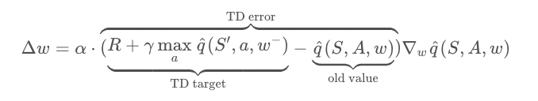
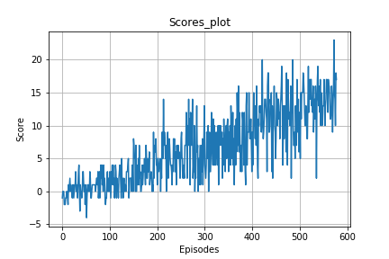

# REPORT

## Learning Algorithm

The learning algorithm is a simple Q-learning algorithm.
The network is trained to predict the best action to take given the current state - it acts as a function approximation.

The inputs are the current state, and the outputs are the Q-values for each action. As a reinforcement signal, it is 
fed the game score.

The details of the network are described in this [Deep Q network paper](https://storage.googleapis.com/deepmind-media/dqn/DQNNaturePaper.pdf). 
Here, I am briefly summarizing the network architecture.


### Experience Replay
When the agent interacts with the environment, the sequence of experience tuples can be highly correlated. The naive Q-learning algorithm that learns from each of these experience tuples in sequential order runs the risk of getting swayed by the effects of this correlation. By instead keeping track of a replay buffer and using experience replay to sample from the buffer at random, we can prevent action values from oscillating or diverging catastrophically.

The replay buffer contains a collection of experience tuples `(S, A, R, S')`. The tuples are gradually added to the buffer as we are interacting with the environment.

The act of sampling a small batch of tuples from the replay buffer in order to learn is known as experience replay. In addition to breaking harmful correlations, experience replay allows us to learn more from individual tuples multiple times, recall rare occurrences, and in general make better use of our experience.

### Fixed Q-targets
In Q-Learning, we update a guess with a guess, and this can potentially lead to harmful correlations. To avoid this, we can update the parameters `w` in the network
`q_hat` to better approximate the action value corresponding to state `S` and action `A` with the following update rule:



where `w-` are the weights of a separate target network that are not changed during the learning step. 
And `(S, A, R, S')` is an experience tuple.

### Summary

Thus, the Deep Q-learning algorithm uses two separate networks with identical architectures.  The target Q-Network's weights are updated less often (or more slowly) than the primary Q-Network.  Without fixed Q-targets, we would encounter a harmful form of correlation, whereby we shift the parameters of the network based on a constantly moving target.


### Chosen hyperparameters

The hyperparameters of the network are chosen to be as follows:

```python
train_params = {
'BUFFER_SIZE' : int(1e5),  # replay buffer size
'BATCH_SIZE' : 64,         # minibatch size
'GAMMA' : 0.99,            # discount factor
'TAU' : 1e-3,              # for soft update of target parameters
'LR' : 5e-4,               # learning rate 
'UPDATE_EVERY' : 4        # how often to update the network
}

```

Also, the DQN network is comprised of three fully connected layers. All layers are a fully connected layer with 64 units, 
after first two a ReLU activation function is applied, see `model.py` for implementation details.

In particular, the choice of hyperparamters was arbitrary here, for the sake of simplicity. In general, 
the hyperparameters can be optimized with random search, hyperband approaches or bayesian optimization.

For the sake of simplicity, I have chosen the hyperparameters above.

## Plot of rewards

A plot of rewards per episode is included to illustrate that the agent is able to receive an average reward (over 100 episodes) of at least +13. 
The number of episodes needed to solve the environment: 477 episodes (see `Navigation.ipynb` notebook).




## Ideas for Future Work

### Hyperparameter Tuning
As mentioned in  `Chosen hyperparameters` above, the hyperparameters of the network can be optimized with random search, hyperband approaches or bayesian optimization.
This could potentially lead to better performance, with the tradeoff of more computation time.


### Architecture Tuning

Several improvements to the original Deep Q-Learning algorithm have been suggested. 

Implementing either of them (or all) could potentially lead to better performance.


#### Double DQN
Deep Q-Learning tends to [overestimate action values](https://www.ri.cmu.edu/pub_files/pub1/thrun_sebastian_1993_1/thrun_sebastian_1993_1.pdf). Double Q-Learning has been shown to work well in practice to help with this.


Double Q-learning can make estimation more robust by selecting the best action using one set of parameters `w`, but evaluating it using a different set of parameters `w'`

See this [paper](https://arxiv.org/abs/1509.06461) for more details.

#### Prioritized Experience Replay
Deep Q-Learning samples experience transitions uniformly from a replay memory. Prioritized experienced replay is based on the idea that the agent can learn more effectively from some transitions than from others, and the more important transitions should be sampled with higher probability.


- **Problem**: If the TD error is zero, then the priority value of the tuple and hence its probability of being picked will also be zero. This doesn't necessarily mean we have nothing more to learn from such a tuple. It might be the case that our estimate was closed due to the limited samples we visited till that point.
- **Solution**: To prevent tuples from being starved for selection, we can add a small constant `e` to every priority value. 


- **Problem**: Greedily using priority values may lead to a small subset of experiences being relayed over and over, resulting in an overfitting to that subset.
- **Solution**: Reintroduce some element of uniform random sampling. This adds another hyperparameter `a` which we use to redefine the sample probability.

See this [paper](https://arxiv.org/abs/1511.05952) for more details.

#### Dueling DQN
Currently, in order to determine which states are (or are not) valuable, we have to estimate the corresponding action values for each action. However, by replacing the traditional Deep Q-Network (DQN) architecture with a dueling architecture, we can assess the value of each state, without having to learn the effect of each action.

The core idea of dueling networks is to use two streams

- one stream estimates the state value function: `V(s)V(s)`
- one stream estimates the advantage for each action: `A(s,a)A(s,a)`

Finally, by combining the state and advantage values, we are able to obtain the desired Q-values.

See this [paper](https://arxiv.org/abs/1511.06581) for more details.

#### Rainbow

Apart from the abovementioned potential solutions, many more extensions have been proposed, including:

- [Learning from multi-step bootstrap targets](https://arxiv.org/abs/1602.01783)
- [Distributional DQN](https://arxiv.org/abs/1707.06887)
- [Noisy DQN](https://arxiv.org/abs/1706.10295)

**Each of the six extensions address a different issue with the original DQN algorithm.**

Researchers at Google DeepMind recently tested the performance of an agent that incorporated all six of these modifications. The corresponding algorithm was termed [Rainbow](https://arxiv.org/abs/1710.02298).

It outperforms each of the individual modifications and achieves state-of-the-art performance on Atari 2600 games!

**It would be interesting to see if this can be applied to the navigation task, as it could potentially lead to better performance.**